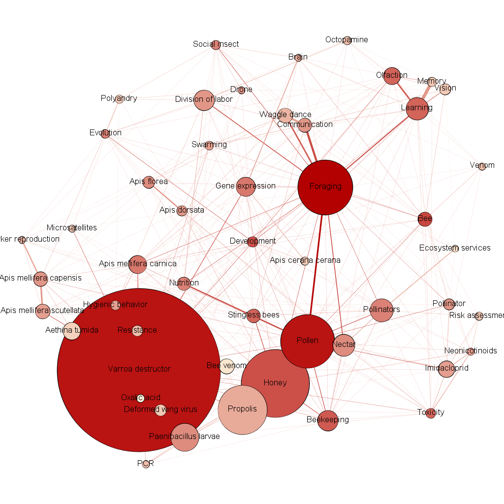

# Honey Bee Health
Aggregating research papers on honey bee health in preperation of topic modeling and natural language processing.

# Tools Used
* Scopus' API and beautiful soup to extract data from research papers.

* Gensim for topic modeling of the research paper terms and tags.

* IPython Notebooks to document all work.

* The notebooks have integrated the use of Gephi graphing utility and a companion utility created by Andrew Strickland.
Gephi allows us to make connections drawn from lexical analysis and visually assess underlying correlations and etc.

#Snippets
Each block of code in the main notebook /src/TopicModeling.ipynb handles the information through a few helper classes and structures created in /src/CustomApi.py.
For example each paper abstract is read in from teh data files in /data/document/lt2006 & gt2006, and the appropriate information is used to create a C-struct (named tuple).
```python
>>> import CustomApi as api
>>> # Each abstract has a 'title':String, 'date':datetime.datetime, 'text':String, and 'keywords':String
>>> abstracts = [api.MyAbstract._make([art[1],datetime.strptime(art[2], '%Y'),removeStops(art[15]), art[16]]) for art in entries]
>>> apstracts.[0].date.year
1974
```
This information is sorted based on occurrence but this is the simple representation of a paper in our program.
Often words must be mapped to an id for gephi to use (hashing wasn't viable because it may result in a negative number), keywords must be tracked and etc. Therefore, the CustomApi has a KeyWordTracker and 
a WordMapper.
```python
>>> import CustomApi as api
>>> wordMapper = api.WordMapper()
>>> wordMapper.mapWord("bee")
0
>>> wordMapper.mapWord("colony")
1
>>> kphTracker = api.KeyPhraseTracker()
>>> keyPhrases = "bee hive; apis mellifera; varroa mite".split(";")
>>> for phrase in keyPhrases:
...    kphTracker.track(phrase)
...    kphTracker.registerregisterCoOccurrences(phrase,keyPhrases)
>>> kphTracker.topN()
#returns yearly occurence objects containing the number of times a phrase was used each year, the first year it was introduced, etc. Many useful member functions reside on CustomApi.KeyPhraseTracker
```
# Methods used
* LDA Model with TF-IDF and DocBow weights for the terms.

* Stop words and regular expressions to strip abstract of punctuation and unneeded words.

* Different numbers of topics for each model to give a range of possible outcomes.

* Data expressed in spreadsheets of most popular terms by year and by document.
